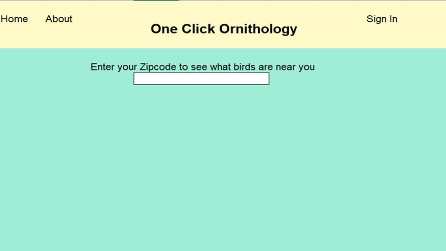
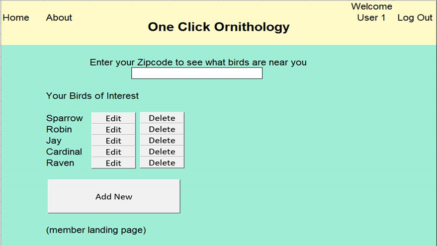
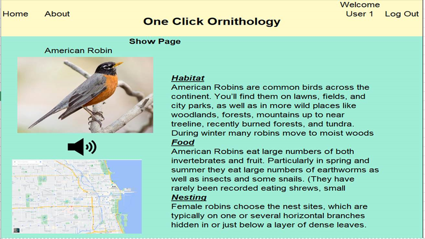

# Project III BIRD CALL: The Everything Bird App; by Max, Kaushik, and Stephen

## User Story

Bird Call is a webpage for Ornithology enthusiasts. If you like birds, this is where you need to be. The idea of this app is to enable birdwatchers to keep a log of their bird sightings, create journal, search for all bird sightings in a state as well as pin birds.

On the home screen of the app users can search for the sightings of various birds in their state.

The app has a log in functionality where users can log in. Once logged in users have the ability to journal their bird sightings. They can create, update, and delete new sightings. This is designed to be an end to end journal for a bird lover.

## The Front End (FE)

For the FE we used REACT and styled it with Semantic UI as well as more traditional CSS elements. We also used an application programming interface (API) which we discuss in the following section.

## The API

The API for this particular website is taken from eBird which is maintained and provided by Cornell University. This allowed us to pull data from their database. These APIs allow us to gather several data points but we have chosen to get name, and location information since we thought this was most pertinent for our purposes. For further information please refer to :

https://confluence.cornell.edu/display/CLOISAPI/eBird-1.1-suggestions

## The Back End (BE)

For the backend we used Node.js and contains the CRUD routes. Some of the routes we used include

1. GET to show a list of all user birds
2. PUT route to unpin birds
3. DELETE route to destroy a journal entry

There are other GET routes and POST routes for the sessions as well.

## Database

For the database to store all the data we have used MongoDB. MongoDB is a document-oriented NoSQL database used for high volume data storage. Instead of using tables and rows as in the traditional relational databases, MongoDB makes use of collections and documents. Documents consist of key-value pairs which are the basic unit of data in MongoDB. Collections contain sets of documents and function which is the equivalent of relational database tables. MongoDB is a database which came into light around the mid-2000s. For further details please refer to:

https://www.mongodb.com/what-is-mongodb

## Original Wire Frames

  

